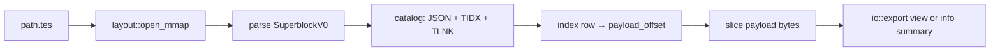
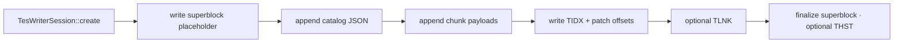

# Tessera reference engine — architecture

**Status:** architecture reference. The v0 engine through Markdown/HTML import,
export views, vault, preview/PDF, edit, and history is implemented; layout v1
additions are planned in [structure_v1.md](structure_v1.md).

This doc sits **between** the wire spec and the user-facing CLI: how bytes become documents, how documents become exports, and what is **not** in the engine (GUI, query stack, Tetration dependency).

| Layer | Doc |
| --- | --- |
| Bytes on disk | [layout_v0.md](layout_v0.md) |
| Decoded views | [exports.md](exports.md) |
| CLI commands | [cli.md](cli.md) |
| Design choices | [decisions.md](decisions.md) |
| Layout v1 semantics | [structure_v1.md](structure_v1.md) |
| Security | [security.md](security.md) |

---

## What “the engine” is

The **Tessera engine** is the reference library (`tessera_doc`) that:

1. **Reads and writes** sealed `.tes` files (mmap, index lookup, payload slice).
2. **Validates** on-disk health (`verify`).
3. **Imports** foreign formats into chunks **once** (`io::import`, `io::bib`).
4. **Exports** decoded views for humans and models (`io::export`).
5. **Resolves** cross-document links across a vault (`vault`).
6. **Renders** semantic HTML with external templates/themes (`render`: serve + PDF).
7. **Applies** editor/agent changes through typed compile/verify/replace (`edit`)
   and content-addressed history (`history`).

It is **not**:

- A GUI or workspace (future product on top; name TBD).
- The Tetration tensor query engine (`tet query`, reductions, GPU).
- A dependency on the `tetration` crate.

The CLI binary (`src/bin/tes.rs`) is a thin wrapper around `tessera_doc::cli::run`.
The LSP binary (`src/bin/tes_lsp.rs`) is a thin wrapper around `tessera_doc::lsp::run`
(open/change/diagnostics/hover + `tessera.write` / willSave write-back). See
[lsp.md](lsp.md).

---

## Layer model

```text
┌─────────────────────────────────────────────────────────────┐
│  tes CLI  (src/bin/tes.rs → tessera_doc::cli::run)          │
│  tes-lsp  (src/bin/tes_lsp.rs → tessera_doc::lsp::run)      │
└───────────────────────────────┬─────────────────────────────┘
                                │
┌───────────────────────────────▼─────────────────────────────┐
│  Domain layer (document semantics)                          │
│  io/ (import · export · bib) · vault/ · edit/ · history/    │
│  render/ (template · preview · pdf) · lsp/ (Tessprek LSP)   │
└───────────────────────────────┬─────────────────────────────┘
                                │
┌───────────────────────────────▼─────────────────────────────┐
│  Catalog layer (document model in one file)                 │
│  catalog/ — session writer, chunk payloads, link table, THST│
└───────────────────────────────┬─────────────────────────────┘
                                │
┌───────────────────────────────▼─────────────────────────────┐
│  Container layer (sealed chunked file)                      │
│  layout/ · verify/ · repair? · argus-chunk (LE + codecs)    │
│  superblock, TIDX, THST, bounds, codecs                     │
└───────────────────────────────┬─────────────────────────────┘
                                │
                                ▼
                         .tes bytes on disk
```

**Rule:** upper layers call lower layers; container code never imports Markdown parsers or HTML templates.

---

## Module map

| Module | Responsibility | Spec / doc |
| --- | --- | --- |
| `layout` | `SuperblockV0`, mmap open, region bounds, magic/version checks | [layout_v0.md](layout_v0.md) |
| [argus-chunk](https://crates.io/crates/argus-chunk) | Little-endian primitives, `align8`, raw/zstd codecs | external crate |
| `catalog::index` | `TIDX` header + 48-byte entries | [layout_v0 — chunk index](layout_v0.md#chunk-index-region) |
| `catalog::document` | Document catalog JSON parse/serialize | [layout_v0 — catalog](layout_v0.md#document-catalog) |
| `catalog::link` | `TLNK` table read/write | [layout_v0 — link table](layout_v0.md#link-table-optional) |
| `catalog::chunk` | Text/cite payload encode/decode | [layout_v0 — chunk types](layout_v0.md#chunk-types) |
| `catalog::history` | Optional `THST` footer (wire) | [layout_v0 — footer](layout_v0.md#optional-history-footer-v0) |
| `catalog::session` | `TesWriterSession` — seal one `.tes` | Phase 1 |
| `verify` | Layout health, findings, formatters | [cli — verify](cli.md#tes-verify) |
| `io::export` | `--raw`, `--ai-text`, `--chunks-jsonl`, … | [exports.md](exports.md) |
| `io::import` | `--markdown`, `--html` | [decisions](decisions.md) |
| `io::bib` | BibTeX / CSL-JSON bibliography interchange | [exports.md](exports.md#bibliography) |
| `vault` | Multi-file link resolve, backlinks, search (scan / Tantivy) | Phase 5 / THI-223 |
| `render` | Template packs, `tes serve`, print PDF | Phase 7 |
| `edit` | Tessera Markdown + typed safe mutation | Layout v1 |
| `history` | save/log/diff/blame/pending/`merge-file` over THST | M10 |
| `cli` | Clap surface + command runners for `tes` | [cli.md](cli.md) |
| `lsp` | `tes-lsp` Tessprek language server (stdio) | [lsp.md](lsp.md) |

Crate-root aliases keep `tessera_doc::{export,import,bib,pdf,preview,template}` resolving to the `io` / `render` submodules.

`repair/` is **optional** post–v0 (Tetration parity); not in the module tree.

---

## Read path



**Steps (library):**

1. **`layout::open_mmap`** — read-only map; file length for bounds.
2. **`layout::read_superblock_v0`** — validate `TESS`, version `0`, offsets.
3. **`catalog::read_catalog`** — optional JSON blob → `DocumentCatalog`.
4. **`catalog::read_index`** — parse `TIDX` header + fixed entries.
5. **`catalog::read_link_table`** — optional `TLNK` entries.
6. **Payload access** — `mmap[off..off+len]`; zstd decode if `codec = 1`.
7. **Consumers** — `tes info` summarizes; `io::export` decodes text headers + bodies.

Reads do **not** re-parse Markdown or HTML. Canonical text is already in chunk bodies.

---

## Write path



**Steps (library):**

1. **`TesWriterSession::create(path)`** — exclusive create; in-memory index rows.
2. **Catalog** — write JSON at planned offset; record in superblock fields.
3. **Chunks** — append payloads (text UTF-8 default raw); push index rows with `chunk_id`, type, offsets.
4. **Link table** — if links/cites added, write `TLNK` after catalog or before index (reference writer: before index).
5. **Chunk index** — write `TIDX` header + rows; set `chunk_index_offset/length` in superblock.
6. **Finalize** — rewrite superblock with final offsets; optional `THST` + set `flags & 1`.

Single-writer, sealed file — same concurrency model as Tetration ([layout_v0 — concurrency](layout_v0.md#concurrency-informative)).

Layout v1 mutation adds a short advisory per-file lock, source-hash recheck,
sibling temporary output, deep verification, and atomic replacement. Existing
mmap readers continue reading the old file until they reopen the replaced path.

**Import path** builds chunks in memory then calls the same session API (`io::import` → `session`).

---

## Export and import (domain layer)

| Direction | Module | Input → output |
| --- | --- | --- |
| **Export** | `io::export` | mmap’d `.tes` → UTF-8 view (stdout or file) |
| **Import** | `io::import` | foreign file → `TesWriterSession` → `.tes` |
| **Bibliography** | `io::bib` | BibTeX/CSL ↔ cite chunks |

Export **never** writes back to canonical chunks except via explicit re-import. Import **parses once** at boundary; see [decisions — parse once](../README.md#design-principles).

View contracts: [exports.md](exports.md). CLI flags: [cli.md](cli.md).

---

## Verify

`verify` sits in the container/catalog boundary (`verify::checks` + `verify::report`):

| Check | Layer |
| --- | --- |
| Magic, version, offset arithmetic | `layout` |
| Catalog JSON schema | `catalog` |
| `TIDX` / `TLNK` magic and entry bounds | `catalog` |
| Payload bounds, UTF-8 sample decode | `catalog` + `verify` |
| `THST` when flagged | `catalog::history` |

Report shape follows Tetration (`TetVerifyReport`-style): findings, severity, JSON/text formatters — implemented fresh in `tessera`, not imported from `tetration`.

---

## Relationship to Tetration

| Tetration | Tessera engine |
| --- | --- |
| `layout.rs` + `catalog/` | Same **pattern**, different superblock/index/catalog |
| `query/` (~100+ files) | **Absent** — replaced by `io::export` views |
| `convert/` (HDF5, NetCDF, Zarr) | **Absent** — replaced by `io::import` (MD, HTML) + `io::bib` |
| `export/zarr` | **Absent** — `io::export` text/HTML/JSONL |
| `verify/`, `repair/` | **Similar structure**, document-specific checks |
| `THST`, `TIDX` header, codec 0/1 | **Reuse ideas**; LE wire + codecs via [argus-chunk](https://crates.io/crates/argus-chunk) |

**No `tetration` dependency.** Shared wire lives in `argus-chunk`; domain layouts stay in each format crate ([decisions D7](decisions.md#tetration-wire-reuse)).

---

## v0 engine scope

**In:**

- `layout`, `catalog` (session, index, catalog JSON, text/media/slide/attachment chunks, THST wire)
- `verify` (basic + deep), `repair` (`tes repair` — THI-225: footer clear + drop OOB chunks)
- `io::export` (`--raw`, `--linear`, `--ai-text`, `--chunks-jsonl`, Markdown/HTML, bibliography, `--attachment`)
- `io::import` (Markdown, HTML), `io::bib`
- `vault`, `render` (serve + PDF; `/media/` images, `/attachment/` downloads), `edit`, `history` (M10: save/log/diff/blame/pending/merge-file/export-revs/checkout/textconv)
- `cli` + `tes` binary: info, verify, repair, export, import, link, vault, serve, edit-*, format, apply, save/log/diff/changelog/blame/pending/export-revs/checkout/textconv/merge-file

**Out (later):**

- Future GUI, CRDT, page tensors, non-Chromium PDF (THI-256)

---

## Public API sketch (library)

Embedders: `use tessera_doc::prelude::*;` or module paths under `io` / `render` / `edit` / …

| Type / fn | Role |
| --- | --- |
| `TesFile` | mmap’d open document |
| `TesWriterSession` | create / append / commit |
| `verify_tes_file` | health report |
| `export_view(path, ExportView::AiText)` | decoded projection |
| `import_markdown_v0` / `import_html_v0` | foreign → `.tes` |
| `cli::run` | full `tes` argv dispatch |

CLI / LSP binaries mirror these; no duplicate domain logic in `src/bin/tes.rs` or
`src/bin/tes_lsp.rs`.

---

## Testing strategy

| Layer | Tests |
| --- | --- |
| Container | Golden byte fixtures ([layout_v0 — fixtures](layout_v0.md#golden-fixtures-planned)) |
| Round-trip | write session → mmap read → same index/catalog |
| Export | golden `.txt` / `.jsonl` diffs |
| Verify | corrupt fixtures → exit 1, expected findings |
| Import | MD → tes → export MD structure |

---

## See also

- [roadmap.md](roadmap.md) — phase order and first issues
- [format-comparison.md](format-comparison.md) — why HTML is export, not canonical
- [glossary.md](glossary.md) — terms
